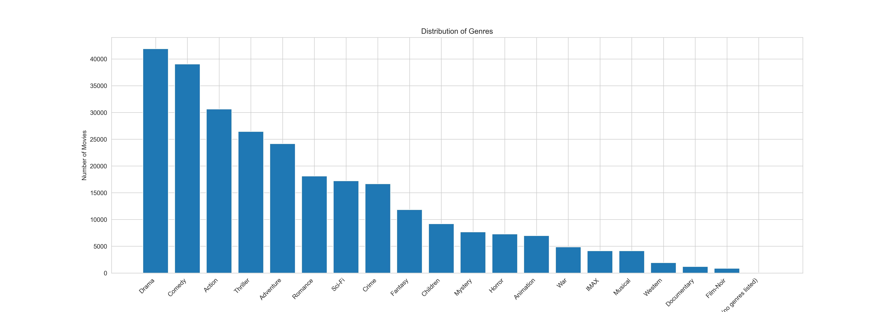
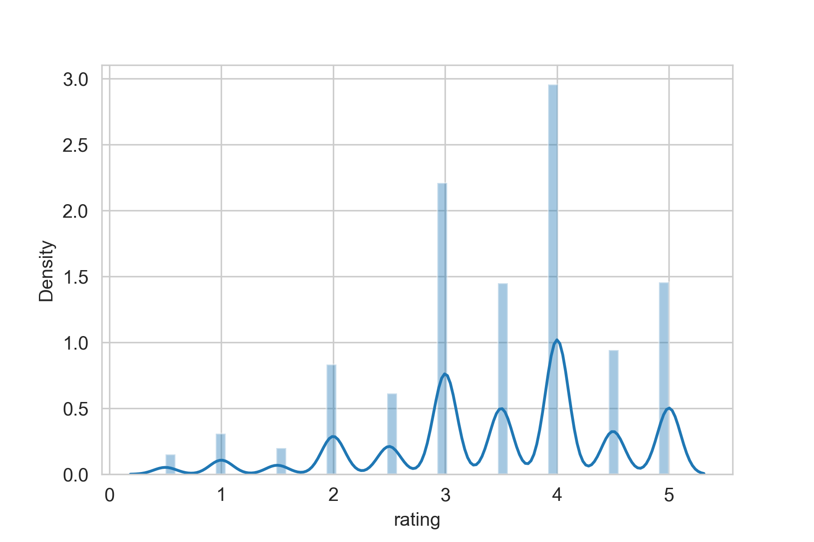
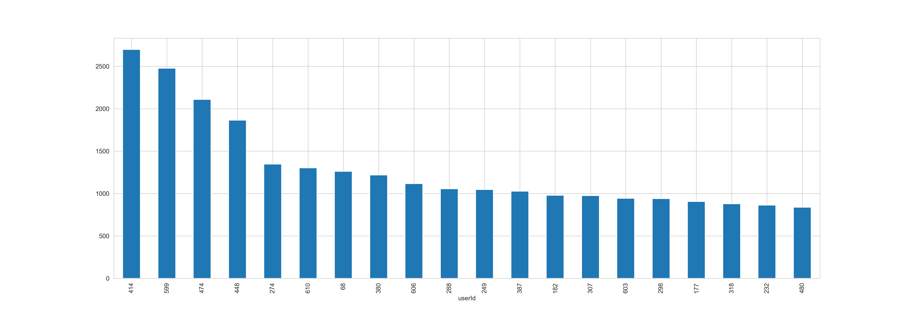
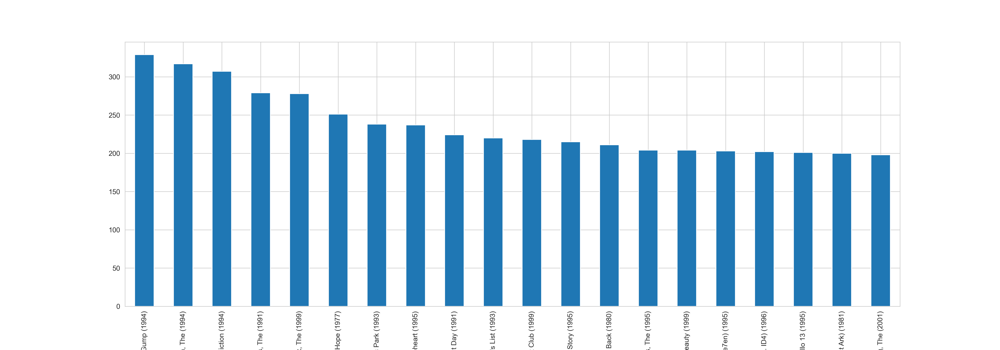
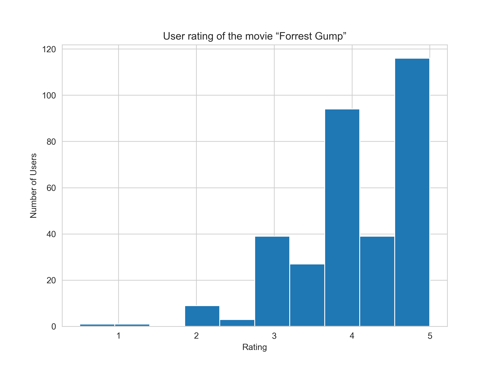
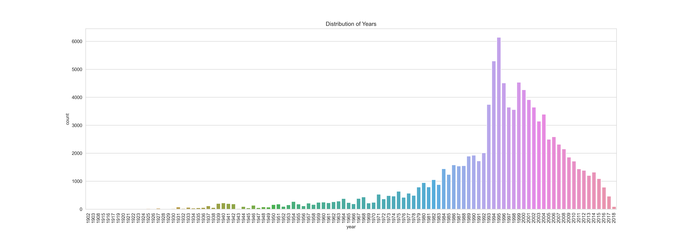

# MOVIE RECOMMENDER SYSTEM
**Authors**: Lucy Munge, Frank Mandele, Sylvester Magunda

## Project Overview
**Building a Comprehensive Movie Recommendation System**
In this project, our goal is to design and implement a versatile movie recommendation system employing three distinct techniques: a simple recommender, collaborative filtering, and content-based filtering. Leveraging the MovieLens dataset, we aim to provide users with personalized recommendations for the top 5 movies.
    
The **simple recommender model** will prioritize movies based on their overall popularity. Utilizing metrics such as ratings count, reviews(user ratings) we will generate a list of top movies that have garnered widespread acclaim.

The **collaborative filtering approach** takes center stage as our primary recommender. By analyzing user behavior and preferences, the system will identify similar users or movies, providing recommendations based on collective user experiences. This model is crucial for offering personalized suggestions rooted in user interactions.
    
To tackle the **cold-start problem**, especially pertinent for new users and items, we will implement a **content-based filtering model**. This approach relies on the intrinsic features of movies, such as genre, director, and actors, to provide recommendations until sufficient user interaction data is accumulated.

The project's success will be evaluated using established metrics such as RMSE and MAE scores, ensuring the effectiveness of each recommendation technique. By combining the strengths of these diverse models, our system aims to deliver accurate and user-centric movie recommendations, enhancing the overall user experience and addressing the challenges posed by the cold-start problem.

## Business Understanding
Tazama, a leading streaming platform in the entertainment industry, is facing a critical business challenge in the era of personalized user experiences. The industry trend towards customized content consumption has heightened the demand for effective recommendation systems. In response, Tazama is aiming to elevate user satisfaction and engagement by implementing a robust movie recommendation system.

The primary objective is to design and implement a recommendation system that accurately suggests the top 5 movies to each user based on their ratings of other films. Tazama intends to leverage the MovieLens dataset from the GroupLens research lab at the University of Minnesota, specifically focusing on the "small" dataset containing 100,000 user ratings. This dataset is viewed as a valuable resource for training the recommendation algorithm to understand user preferences and deliver personalized content suggestions.

The successful implementation of this recommendation system is crucial to Tazama's user interface, as it will play a pivotal role in influencing the content users interact with on the platform. The effectiveness of the system directly impacts user satisfaction, retention, and overall engagement with the Tazama streaming service. Therefore, we have been tasked to develop an effective and accurate recommendation system that enhances the overall user experience, contributing to Tazama's competitive edge in the dynamic entertainment market.

## Data Understanding

Our data source for this project is the MovieLens dataset, a comprehensive collection of user interactions with movies. The dataset includes key information such as user ratings, movie metadata, and user demographics. The link to the MovieLens dataset: https://grouplens.org/datasets/movielens/latest/. The data are contained in four different files which are all loaded and viewed. The files are movies.csv, ratings.csv, links.csv, and tags.csv

Variables like movie titles, genres, user IDs, and ratings form the core of our data, enabling us to capture user preferences and movie characteristics. Additionally, we have access to metadata encompassing movie details such as genres, tags, and release years. Here are some common columns found in the MovieLens datasets:

- userId: An identifier for the user who provided the movie rating.
- movieId: An identifier for the movie that was rated.
- rating: The user's rating for a particular movie, often on a scale (e.g., 1 to 5 stars)
- timestamp: The timestamp indicating when the rating was given by the user. It is usually in Unix epoch format.
- title: The title of the movie.
- genres: A list of genres associated with the movie. Movies can belong to multiple genres

The predominant genres among released movies are Drama, Comedy, Thriller, Action, and Romance, establishing them as the top five most popular genres in the dataset.

On the whole, the majority of movies received a rating of 4, indicating a prevalent positive sentiment among viewers. In contrast, ratings of 0.5 were the least common, suggesting that very few movies garnered such low evaluations from users.

User 414 rated most movies they watched

Movie ratings are unevenly distributed, with the film **'Forrest Gump'** being the most rated, receiving approximately 350 ratings

Most of the **'Forrest Gump'** audience ratings are 4 and 5.

The dataset encompasses movies dating back to 1902, with the most recent film recorded in 2018. The years with high number of rated movies in this dataset is notably between 1993 and 2004, with 1995 being the highest.

## Modelling 
Multiple models are constructed including: popularity-based, collaborating filtering, and content-based. 

## Evaluation
The best recommendation system is a hybrid system that includes all the three models i.e popularity-based, collaborating filtering, and content-based.

## Recommendations
**User Engagement:**
Enhance user engagement by incorporating user feedback mechanisms. Allow users to rate and provide feedback on recommended movies. This data can be used to continuously refine and improve the recommendation algorithms.

**User Interface and Experience:**
Develop an intuitive and user-friendly interface for users to interact with the recommendation system. This could include personalized dashboards, easy-to-use rating interfaces, and a visually appealing presentation of recommended movies.

**Cold Start Problem Mitigation:**
Implement strategies to address the cold start problem, especially for new users who have limited or no interaction history. Content-based filtering can be particularly useful in such scenarios by recommending movies based on their features.

**Regular Model Evaluation:**
Establish a routine for regular model evaluation using metrics such as RMSE for collaborative filtering and precision/recall for content-based filtering. This ensures that the models are performing well over time and allows for timely adjustments.

**Marketing and Promotion:**
Leverage the recommendation system to inform marketing and promotion strategies. Identify popular genres and movies among users and use this information to target promotions, advertisements, or partnerships with content creators.

**Data Privacy and Security:**
Implement robust data privacy measures, especially when dealing with user ratings and preferences. Clearly communicate your data usage and privacy policies to build trust among users.

**Collaboration with Content Creators:**
Explore partnerships with content creators or studios to obtain early access to new releases. This can give your recommendation system an edge by providing users with personalized recommendations for the latest content.

**Community Building:**
Foster a community around your platform by allowing users to share and discuss their favorite movies. Implement features such as user-generated lists, reviews, and forums to create a sense of belonging among users.

**Performance Monitoring:**
Implement monitoring tools to track the performance of your recommendation system in real-time. Detect anomalies, user behavior changes, or system errors promptly and take corrective actions.

**Scalability:**
Design your recommendation system with scalability in mind to accommodate a growing user base and an expanding movie database. This ensures that the system can handle increased loads without sacrificing performance.

## Conclusions
In concluding this project, we've delved into the intricacies of recommender systems, exploring the collaborative-filtering approach and its variants. Through the journey of employing memory-based methods, model-based methods like Singular Value Decomposition (SVD), and exploring the nuances of content-based filtering, we've uncovered the strengths and limitations of each technique.

The findings underscore the importance of recognizing the unique challenges posed by collaborative filtering, such as the cold-start problem, and the need for supplementary strategies to address these issues. While SVD emerged as a promising model for collaborative filtering, we also explored content-based filtering to mitigate challenges like the cold-start problem.

Our exploration further extends to the realm of hybrid recommender systems, recognizing the value of amalgamating collaborative and content-based approaches. The synergy of different algorithms and methodologies in a hybrid model offers a more nuanced and adaptable solution, overcoming individual limitations.

As we navigated through the intricacies of our dataset, making predictions, and generating recommendations, we've not only gained technical insights but also confronted real-world challenges. The user cold-start problem and item cold-start problem have been acknowledged, prompting us to explore content-based systems to offer more inclusive recommendations.

In the dynamic landscape of recommendation systems, this project serves as a foundation for understanding and implementing diverse methodologies. The hybrid approach advocated here provides a robust strategy, ensuring our system remains versatile and resilient to the evolving needs of users.

In essence, this project's conclusion is a call to embrace the diversity of recommender system methodologies. By understanding the strengths and weaknesses of different approaches, we position ourselves to craft a more comprehensive, user-centric, and enduring solution for recommendation challenges.
